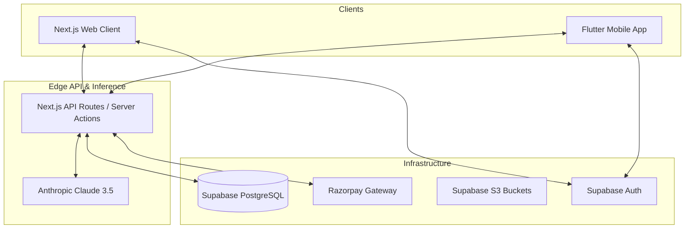

<div align="center">
  
  <h1>FitForge AI</h1>
  <p><b>Enterprise-Grade AI Fitness Architecture & Trainer Marketplace</b></p>

  [](https://nextjs.org/)
  [](https://flutter.dev/)
  [](https://supabase.com/)
  [](https://anthropic.com/)
  [](https://razorpay.com/)
</div>

<br/>

## 📖 Overview

FitForge is a full-stack, AI-native fitness ecosystem engineered for absolute scale. It operates on a monorepo-style structure housing a highly optimized **Next.js 14 web application** and a **cross-platform Flutter client**. 

The platform leverages **Supabase** for edge-optimized PostgreSQL/Auth, **Razorpay** for complex marketplace payment routing, and the **Anthropic Claude 3.5 Sonnet API** to dynamically generate context-aware, hyper-personalized fitness and nutrition regimens.

---

## 🏗 System Architecture

The ecosystem relies on a highly decoupled architecture separating the presentation layer from the AI inference engine.



---

## 🚀 Technology Stack

### Front-End (Web)
- **Framework:** Next.js 14 (App Router, React Server Components)
- **Styling:** Tailwind CSS + Radix UI Primitives (Shadcn UI)
- **Data Visualization:** Recharts
- **Animations:** Framer Motion

### Front-End (Mobile)
- **Framework:** Flutter 3.19 (Dart)
- **Routing:** GoRouter (Deep-link enabled)
- **State Management:** Riverpod / setState (component-level)
- **Animations:** Flutter Animate (60fps Glassmorphic UI)

### Backend & Infrastructure
- **Database:** Supabase (PostgreSQL with Row Level Security)
- **Authentication:** Supabase Auth (JWT, Magic Links)
- **File Storage:** Supabase Storage (CDN-backed)
- **LLM Engine:** Anthropic Claude 3.5 Sonnet (`claude-3-5-sonnet-20240620`)
- **Payments:** Razorpay (Handling subscriptions and B2B vendor splits)

---

## 🧠 AI Inference Engine

FitForge utilizes a deterministic prompting architecture to force the LLM to output structured JSON data for complex fitness data structures.

- **Workout Generation:** Analyzes physiological stats (BMI, age, goal) to map out N-day microcycles.
- **Nutrition Generation:** Calculates precise macros and outputs grocery lists with corresponding micronutrient density graphs.
- **AI Coach:** A conversational agent that parses user history dynamically via API contexts to offer localized advice.

---

## 🛠 Installation & Setup

### 1. Web Application Configuration

```bash
# Clone the repository
git clone https://github.com/your-org/fitforge.git
cd fitforge

# Install Node dependencies
npm install

# Configure environment variables
cp .env.example .env.local
```

**Required Environment Variables:**
```env
NEXT_PUBLIC_SUPABASE_URL=your_supabase_url
NEXT_PUBLIC_SUPABASE_ANON_KEY=your_supabase_key
ANTHROPIC_API_KEY=sk-ant-...
RAZORPAY_KEY_ID=rzp_test_...
RAZORPAY_KEY_SECRET=your_secret
```

```bash
# Start the Next.js development server
npm run dev
```

### 2. Database Migrations

FitForge relies on a strictly typed PostgreSQL schema. Execute the raw SQL migration found in `supabase/migrations/001_initial_schema.sql` via the Supabase Dashboard SQL Editor to instantiate the tables, RLS policies, and trigger functions.

Ensure the following Storage buckets are initialized with public read access:
- `avatars`
- `progress-photos`
- `program-covers`
- `program-pdfs`

### 3. Flutter Client Configuration

The Flutter app shares the Supabase backend but relies on the Next.js API layer for LLM inference (preventing client-side API key leakage).

```bash
cd mobile

# Initialize environment configuration
cp .env.example .env

# Fetch Dart dependencies
flutter pub get

# Compile and run
flutter run --debug
```

**Mobile Environment Mapping (`mobile/.env`):**
- `SUPABASE_URL` / `SUPABASE_ANON_KEY`
- `API_BASE_URL`: Point to your Next.js instance (`http://10.0.2.2:3000` for Android emulators or your local IP for physical devices).

---

## 🛡️ Security Posture
- **Row Level Security (RLS):** All Postgres tables implement strict policies ensuring users can only read/mutate their respective `user_id` rows.
- **API Sandboxing:** The Anthropic API key is strictly contained within Next.js Server Actions; the mobile app utilizes an authenticated proxy route.
- **Stateless Auth:** Session state is managed via secure, HttpOnly cookies on the web and secure local storage on mobile via the Supabase SDK.

---

## 📝 License
Copyright © 2026. All rights reserved.
